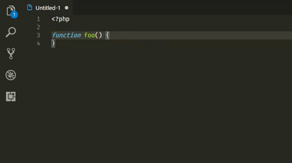

# Semicolon insertion shortcut for VS Code

Adds a shortcut to insert a semicolon at the end of the line. This plugin is based in a feature of our good old NetBeans.

## Features

By pressing `ctrl+shift+;` the plugin will insert a semicolon at the end of the line and add a new line just after it.

> If you don't want a new line, just press `ctrl+;`.

## Usage

Press `ctrl+shift+;` to insert the semicolon at the end of the line and create a new line, or `ctrl+;` to just insert the semicolon.

If you don't like shorcuts, use the command `Insert semicolon`, by pressing `ctrl+shift+p` and typing it.

## LICENSE
See [License](LICENSE.md) file.
